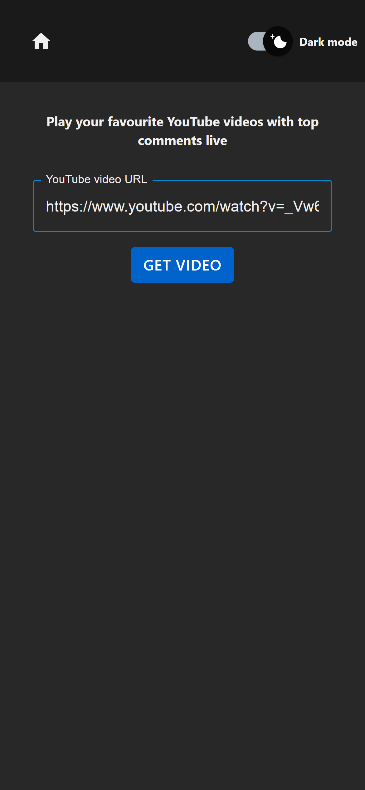
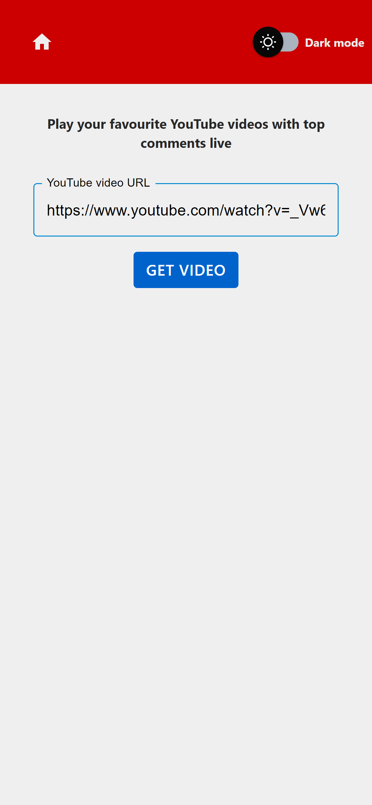
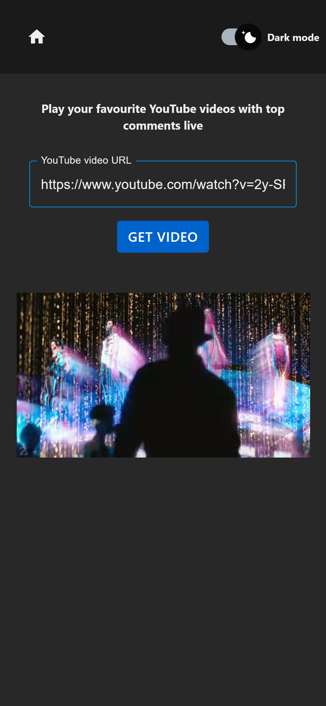
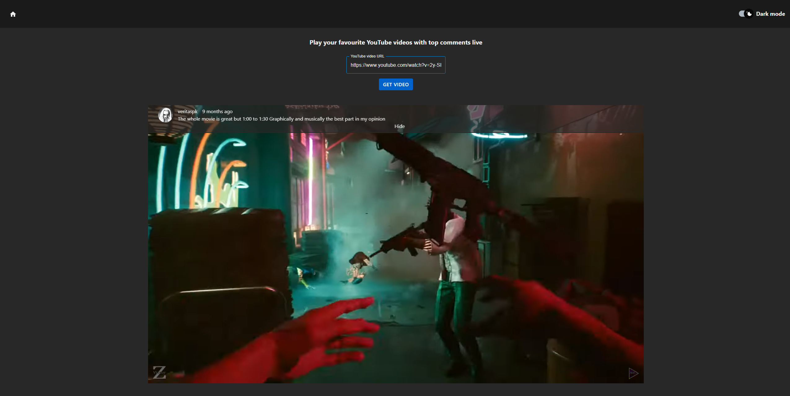

# YouTube Live Popup-Comments

This is an application that utilizes the YouTube Player API Reference and YouTube Data API to dynamically display the most relevant comments as popups while watching the video.

## Table of Contents

- [Installation](#installation)
- [Usage](#usage)
- [Configuration](#configuration)
- [Credits](#credits)

## Installation

1. Open a new terminal and navigate to the root folder.
2. Install the required dependencies by running the following command:

   ```bash
   npm install
   ```

3. Start the development server by running the following command:

   ```bash
   npm start
   ```

Once the server is running, you should be able to access the app in your web browser at http://localhost:3000.

## Usage

Watch your favourite videos in browser without scrolling to the comments section.








## Configuration

The following environment variables need to be set in order for the application to work properly:

GOOGLE_API_KEY: This variable should be set to make requests to Google API (fetching YouTube comments).

Open the .env file and add the environment variables in the following format:

REACT_APP_API_KEY: For example, SESSION_SECRET=your_session_secret_here. To get more info about Google API KEY visit: https://developers.google.com/youtube/v3/getting-started

## Credits

This project utilizes most of all the following libraries, frameworks, and resources:

- [React](https://reactjs.org/): A JavaScript library for building user interfaces.
- [Material-UI](https://material-ui.com/): A popular UI component library for React.
- [Tailwind CSS](https://tailwindcss.com/): A utility-first CSS framework for rapidly building custom user interfaces.
- [Axios](https://axios-http.com/): A promise-based HTTP client for making API requests.
- [React-Youtube](https://www.npmjs.com/package/react-youtube): Simple React component acting as a thin layer over the YouTube IFrame Player API.
- [React-Transition-Group](https://reactcommunity.org/react-transition-group/): A library for managing transitions, manipulating the DOM, and grouping elements in useful ways. It simplifies the implementation of visual transitions, making the process much easier.
- [Date-fns](https://date-fns.org/): A toolset for manipulating JavaScript dates in a browser and Node.js.

Please refer to the documentation or official websites of these resources for more information on how they were used in this project.
